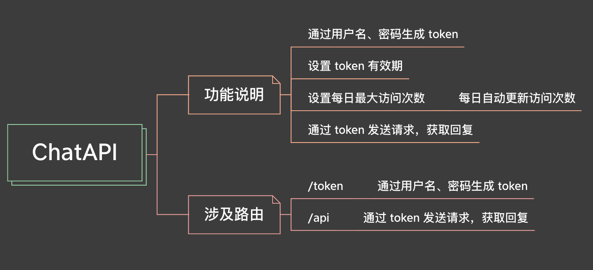

大家好，我是老表。

> 手把手教你使用Python调用 ChatGPT-3.5-API。Hands teach you to use Python to call ChatGPT-3.5-API.
>
>> [https://github.com/XksA-me/ChatGPT-3.5-API](https://github.com/XksA-me/ChatGPT-3.5-API)
>>

这是 `手把手教你使用Python调用 ChatGPT-3.5-API`系列第二篇文章，也是第二个项目：[ChatAPI]([https://github.com/XksA-me/ChatGPT-3.5-API](https://github.com/XksA-me/ChatGPT-3.5-API/ChatAPI)) ，项目功能介绍如下图所示：

## 先跑起来，再理解

更新中。。。

## 更多拓展

你还可以上 Github 搜索更多 ChatGPT 相关项目，或者其他有意思的项目学习练手，欢迎学习交流。

我创建了个 ChatGPT 应用交流群，如果你感兴趣可以扫下方二维码添加我微信申请加入（备注申请原因）。

扫码即可加我微信

